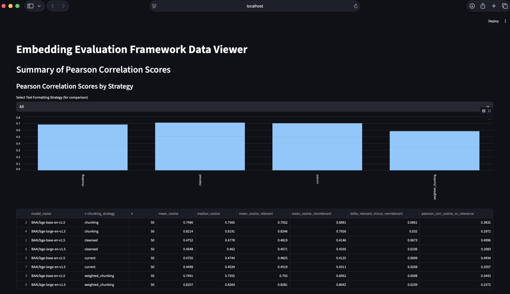
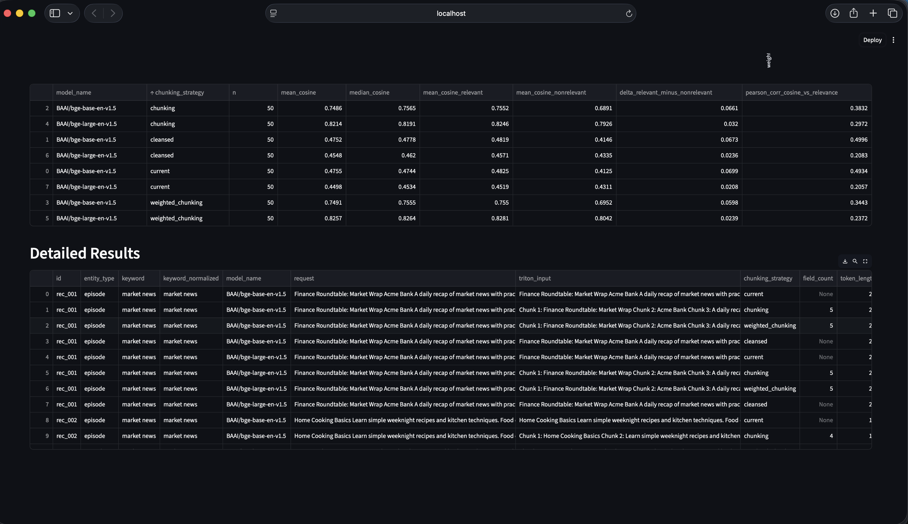
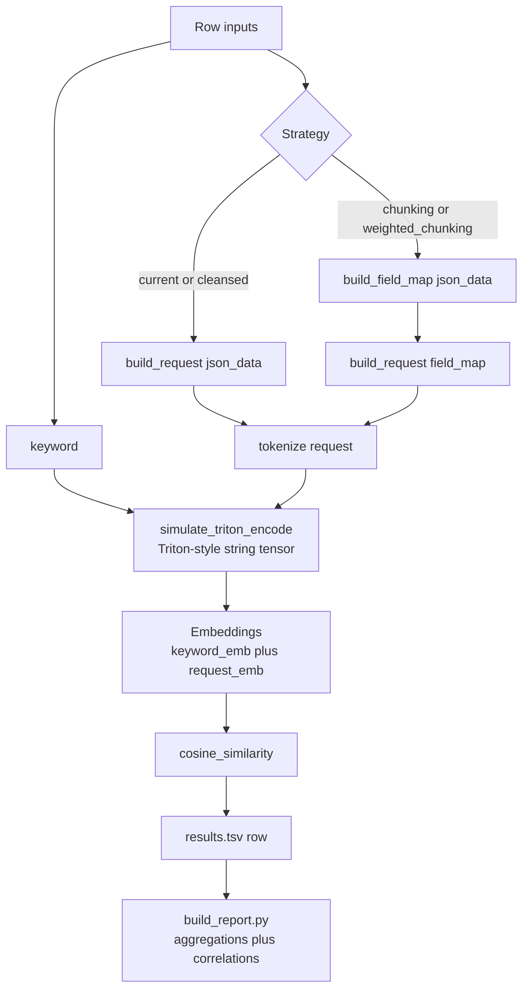
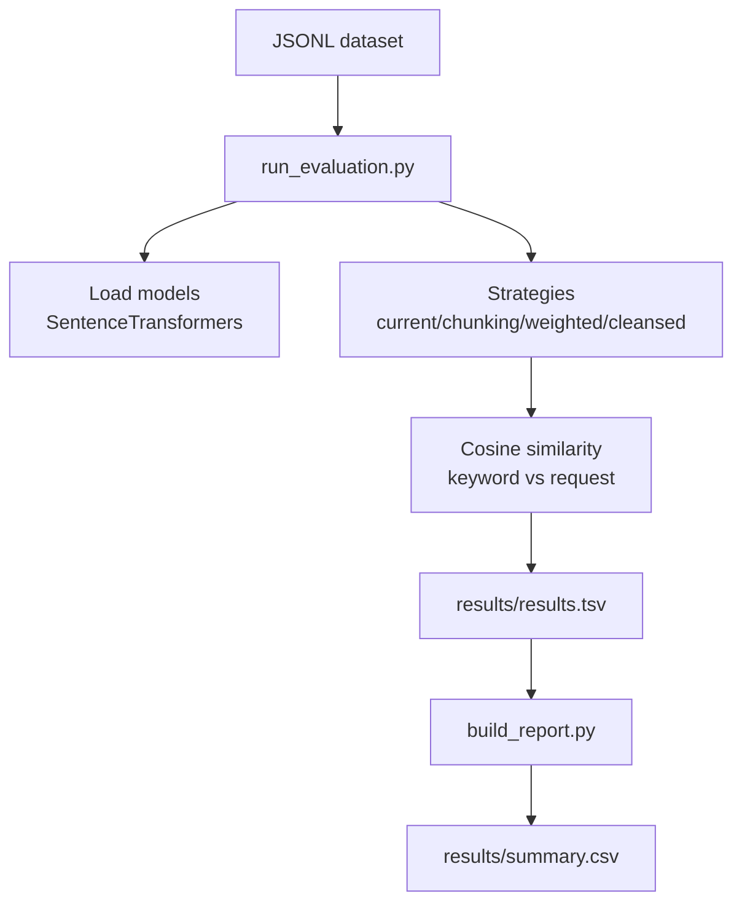

# embedding-eval-framework

[](https://github.com/m-a-singh/embedding-eval-framework/actions/workflows/ci.yml)
[](LICENSE)
[](#)
[](https://github.com/astral-sh/ruff)

## License

MIT — see `LICENSE`.

A model embedding evaluation framework for comparing multiple request-building / chunking strategies across multiple embedding models.

## Expected Output

The following images show the expected output of the Streamlit data viewer:




**(Please add the actual image files to your project, e.g., in an `images/` directory, and update the paths above accordingly.)**

To run the data viewer, use the following command:

```bash
streamlit run ui/data_viewer.py
```

## Repo hygiene

- CI: GitHub Actions runs tests on Python **3.9–3.12** (`.github/workflows/ci.yml`).
- Lint/format: `ruff` (configured for `py39` via `ruff.toml`).
- Tests: `pytest` unit tests cover deterministic helpers (no model download required).


This generic version is designed for **portfolio/public sharing**:
- No company-specific database schemas
- No internal model names
- No Postgres dependency required (uses a local JSONL dataset)

---

## What this demonstrates

- **Strategy ablations, not just model swaps:** compare request-building approaches (`current` vs `chunking`) to isolate whether retrieval quality is dominated by *prompt construction* rather than the embedding model itself.
- **Field-aware retrieval design:** `weighted_chunking` encodes fields independently, applies explicit per-field weights, and then pools—useful when certain attributes (e.g. tags vs description) should contribute more to similarity.
- **Data hygiene as a first-class baseline:** `cleansed` shows how lightweight normalization (ASCII cleanup, whitespace collapse, dedupe) can change embedding inputs and therefore ranking behavior.
- **Production-parity input simulation:** `triton_input_simulator.py` mirrors Triton-style string tensor formatting so you can catch serving-time text formatting issues locally before deploying.
- **Evaluation plumbing that’s easy to extend:** JSONL in → per-(row, model, strategy) TSV out → aggregated report (`build_report.py`) enables quick iteration and adding new strategies/metrics without changing the dataset format.

---

## Architecture (per-row evaluation pipeline)



---

## What it does

Given rows containing:
- an `id`
- an `entity_type`
- `json_data` fields (e.g. `name`, `description`, `sponsors`, `tagCategories`, `tagTopics`)
- a `keyword`
- a labeled `relevance_score`

…the runner builds different request texts, embeds `keyword` + `request`, computes cosine similarity, and writes results to TSV.

---

## Models (default)

By default, the runner compares two public SentenceTransformer models:
- `BAAI/bge-base-en-v1.5`
- `BAAI/bge-large-en-v1.5`

You can override via `--models`.

---

## Strategies

The generic runner evaluates these strategies (see `strategies/`):

- `current`: concatenate normalized fields into one request
- `chunking`: embed each field independently and mean-normalize the pooled embedding
- `weighted_chunking`: like chunking but applies fixed field weights
- `cleansed`: uses basic text cleansing + dedupe before request construction

---

## Dataset

A small synthetic dataset lives at:
- `data/sample.jsonl`

Each line is a JSON object.

---

## Output

A TSV is written containing, per `(row, model, strategy)`:
- request text
- tokens/token length
- cosine similarity
- relevance labels

Default output path:
- `results/results.tsv`

---

## How to run

```bash
python3 run_evaluation.py \
  --data data/sample.jsonl \
  --out results/results.tsv
```

Generate an aggregated summary report:

```bash
python3 build_report.py \
  --in results/results.tsv \
  --out results/summary.csv
```

Filter to a single entity type:

```bash
python3 run_evaluation.py --entity-type episode
```

Evaluate different models:

```bash
python3 run_evaluation.py \
  --models BAAI/bge-base-en-v1.5 BAAI/bge-large-en-v1.5
```

---

## Architecture



## Notes

- Models are downloaded/cached automatically by `sentence-transformers`.
- For a portfolio repo, avoid committing any internal/copyrighted datasets.
